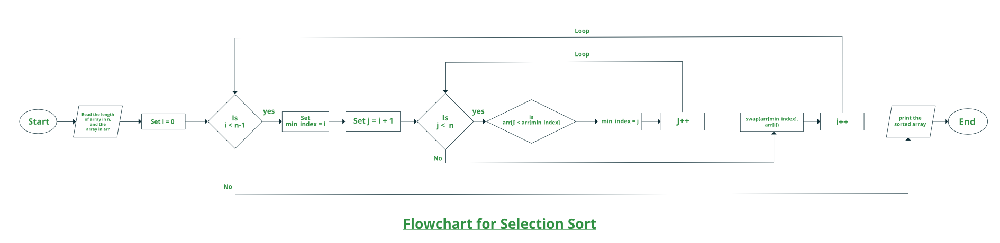

# Selection Sort
**Complexity: 
Worst case = O(n^2) 
Best case = O(n^2)**
  
**Stable? No**
  
**Use case:** It performs well on small lists/ arrays.

### Methodology
- Find maximum item in the whole item
- Swap it with the last element
- Next loop, Find max item in the remaining array while ignoring last element (already in right position)

 Credit to: Geeks For Geeks